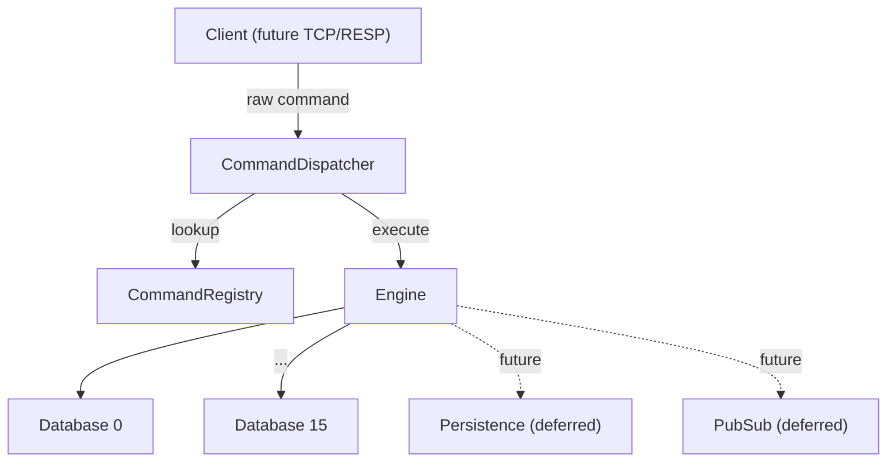
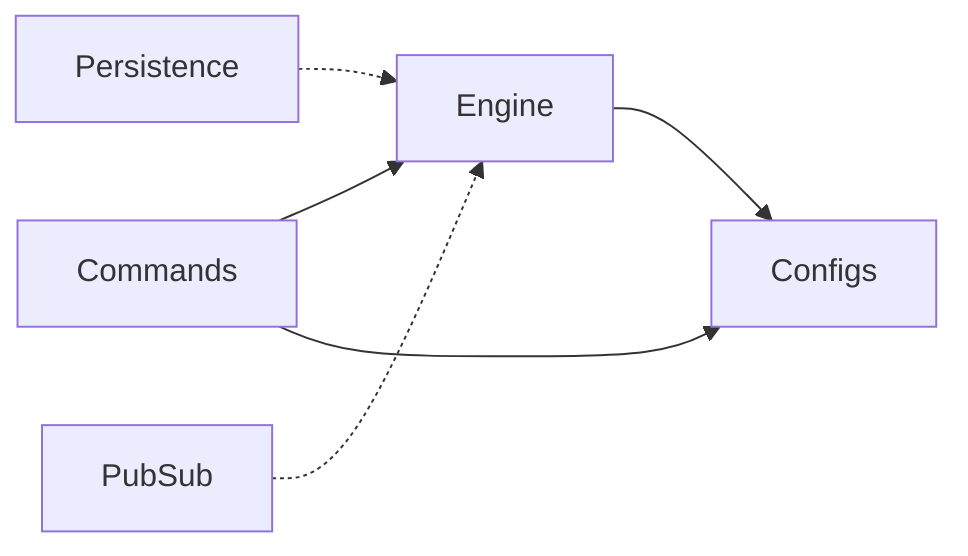

# High-Level Design — Redis-Like In-Memory Data Store Engine

## 1. System Overview

We are building a **production-grade Redis-like in-memory data store engine** with the following characteristics:

- **Language:** TypeScript
- **Runtime:** Bun
- **Core Principle:** Single-threaded deterministic engine — no async in command execution, no locking, no race conditions
- **Architecture Goal:** Match real industry standards from day one

The engine is **protocol-agnostic**. The networking layer (TCP/RESP) is deferred and will be layered on top without modifying the engine internals.

---

## 2. High-Level Architecture



**Flow:** A client sends a raw command string. The `CommandDispatcher` looks up the command in the `CommandRegistry`, validates arity, parses arguments, and delegates execution to the appropriate `Command` handler. The handler interacts with the `Engine` to access the correct `Database` and perform the operation.

---

## 3. Module Boundaries

| Module | Location | Responsibility | Status |
|---|---|---|---|
| **Engine** | `src/engine/` | Owns databases (0-15), provides DB lookup, coordinates global features. Protocol-agnostic. | Implemented |
| **Commands** | `src/commands/` | Dispatcher, Registry, Command base class, Context, Errors. No direct data store access — always goes through Engine/Database API. | Framework implemented |
| **Configs** | `src/configs/` | Constants and defaults (e.g. `DEFAULT_DB_COUNT`). | Implemented |
| **Datatypes** | `src/datatypes/` | Type-specific logic for strings, lists, sets, hashes, streams. | Future |
| **Persistence** | `src/persistence/` | Snapshot/RDB-style persistence. Requires write-command tracking. | Deferred |
| **PubSub** | `src/pubsub/` | Channel system, subscriber tracking, event notification hooks. | Deferred |

### Dependency Direction



Modules depend inward toward the engine core. The engine never depends on commands or the protocol layer. Deferred modules (dashed) will depend on the engine but will not be depended upon by it.

---

## 4. Data Flow — Command Lifecycle

Every command follows a strict, deterministic lifecycle:

```
Client -> Dispatcher -> Parse -> Execute -> Engine -> Database
```

### Phase Separation

**Parse Phase:**
- Pure function — no state access, no side effects
- Validates and normalizes raw arguments
- Throws on invalid input (fail-fast)

**Execute Phase:**
- Uses already-parsed arguments
- Performs state mutations through the Database API
- Enforces Redis semantics
- Synchronous and atomic — no async, no IO

This separation ensures that validation logic is decoupled from business logic, enabling independent testing and future extensibility.

---

## 5. Key Design Decisions

### 5.1 ValueEntry Immutability
- Stored values are wrapped in `ValueEntry` objects that are immutable after construction.
- Updates create new instances via `cloneWithValue()`, preserving `type` and `createdAt` while updating `updatedAt`.
- No in-place mutation of stored values.

### 5.2 Lazy TTL Expiration
- Expired keys are removed on access (lazy expiration), not via a background sweep.
- This matches Redis behavior and avoids the complexity of a background timer.

### 5.3 TTL Preservation on SET
- `SET` does **not** remove or modify TTL — this matches Redis semantics.
- Only `EXPIRE` (and future TTL-related commands) can modify TTL.
- TTL is stored separately from the keyspace in its own `Map<string, number>`.

### 5.4 Write Classification
- Each command declares `isWrite: boolean`.
- This flag is not used in Phase 1 but is architecturally required for future persistence (tracking write commands for snapshots) and replication.

### 5.5 Single-Threaded Execution
- The engine runs on a single event loop.
- Concurrency is handled by serialized command execution and immutable value replacement.
- This eliminates race conditions and the need for locking.

---

## 6. Deferred Features (Architecturally Accounted For)

These features are **not** implemented but the architecture is designed to support them without structural changes.

| Feature | Hook Point | Requirement |
|---|---|---|
| **Persistence (RDB-style snapshot)** | `isWrite` flag on commands, Engine coordination | Copy-on-write safe, write command tracking |
| **Pub/Sub** | `CommandContext.clientId`, Engine event hooks | Channel system, subscriber tracking |
| **RESP Protocol / TCP Server** | Dispatcher input interface | Engine remains protocol-agnostic |
| **Stream Consumer Groups** | `RedisDataType` includes `"stream"` | Pending entries list, consumer tracking |

---

## 7. Current Scope (Phase 1)

### Supported Data Types
- **Strings** (implementing first)
- Lists, Sets, Hashes, Streams — type definitions exist, implementation deferred

### Commands to Implement
1. **SET** — store a string value
2. **GET** — retrieve a string value
3. **EXPIRE** — set TTL on a key

All future commands follow the same architecture: define a `Command` subclass, register it, and the dispatcher handles the rest.
