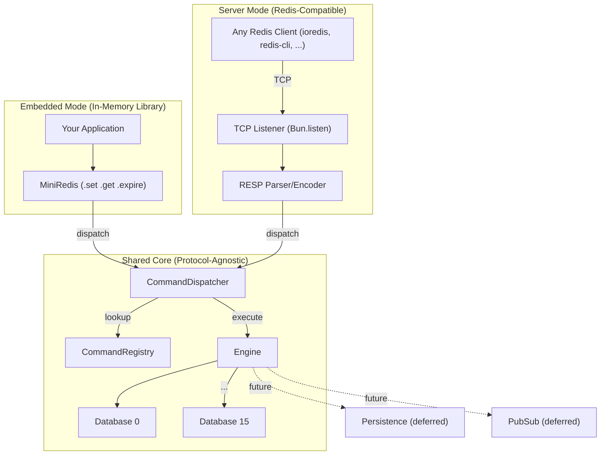
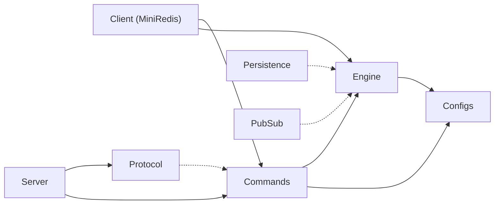

# High-Level Design — Redis-Like In-Memory Data Store Engine

## 1. System Overview

We are building a **production-grade Redis-like in-memory data store** that operates in two modes:

1. **Embedded (in-memory library)** — import `MiniRedis` into any TypeScript/Bun project and use it directly via a fluent API (`.set()`, `.get()`, `.expire()`). No networking, no external process.
2. **Server mode** — call `.listen(port)` on the same `MiniRedis` instance to expose it as a TCP server that speaks the RESP protocol. Any standard Redis client (`ioredis`, `redis-cli`, Jedis, etc.) can connect.

Both modes share the identical engine and command pipeline. The only difference is the entry point.

| Property | Value |
|---|---|
| **Language** | TypeScript |
| **Runtime** | Bun |
| **Core Principle** | Single-threaded deterministic engine — no async in command execution, no locking, no race conditions |
| **Architecture Goal** | Embeddable-first, server-expandable. Match real industry standards from day one. |

The engine core is **protocol-agnostic**. The `MiniRedis` facade provides the consumer-facing API. The networking layer (TCP/RESP) is layered on top without modifying engine internals.

---

## 2. High-Level Architecture

### 2.1 Dual-Mode Overview


```mermaid
flowchart TB
    subgraph EmbeddedMode["Embedded Mode (In-Memory Library)"]
        App["Your Application"]
        MiniRedis["MiniRedis (.set .get .expire)"]
    end

    subgraph ServerMode["Server Mode (Redis-Compatible)"]
        RedisClient["Any Redis Client (ioredis, redis-cli, ...)"]
        TCP["TCP Listener (Bun.listen)"]
        RESP["RESP Parser/Encoder"]
    end

    subgraph Core["Shared Core (Protocol-Agnostic)"]
        Dispatcher["CommandDispatcher"]
        Registry["CommandRegistry"]
        Engine["Engine"]
        DB0["Database 0"]
        DB15["Database 15"]
    end

    Persistence["Persistence (deferred)"]
    PubSub["PubSub (deferred)"]

    App --> MiniRedis
    MiniRedis -->|"dispatch"| Dispatcher

    RedisClient -->|"TCP"| TCP
    TCP --> RESP
    RESP -->|"dispatch"| Dispatcher

    Dispatcher -->|"lookup"| Registry
    Dispatcher -->|"execute"| Engine
    Engine --> DB0
    Engine -->|"..."| DB15
    Engine -.->|"future"| Persistence
    Engine -.->|"future"| PubSub
```

### 2.2 Data Flow by Mode

**Embedded mode:**

```
redis.set("foo", "bar")  →  MiniRedis.set()  →  Dispatcher.dispatch("SET", ["foo","bar"], ctx)  →  Engine  →  Database
```

**Server mode:**

```
redis-cli SET foo bar  →  TCP Socket  →  RESP decode  →  Dispatcher.dispatch("SET", ["foo","bar"], ctx)  →  Engine  →  Database  →  RESP encode  →  TCP Socket  →  +OK
```

Both paths converge at `Dispatcher.dispatch()`. Everything below the dispatcher is shared.

---

## 3. Module Boundaries

| Module | Location | Responsibility | Status |
|---|---|---|---|
| **Engine** | `src/engine/` | Owns databases (0-15), provides DB lookup, coordinates global features. Protocol-agnostic. | Implemented |
| **Commands** | `src/commands/` | Dispatcher, Registry, Command base class, Context, Errors. No direct data store access — always goes through Engine/Database API. | Implemented |
| **Configs** | `src/configs/` | Constants and defaults (e.g. `DEFAULT_DB_COUNT`). | Implemented |
| **Client** | `src/client/` | `MiniRedis` facade — fluent API (`.set()`, `.get()`, `.expire()`, `.select()`). Owns Engine and Dispatcher internally. Public entry point for consumers. | **Phase 2A** |
| **Protocol** | `src/protocol/` | RESP encoder/decoder. Translates between wire bytes and command arrays. | **Phase 2B (deferred)** |
| **Server** | `src/server/` | TCP listener (`Bun.listen`), per-client connection handler. Wires TCP ↔ RESP ↔ Dispatcher. | **Phase 2C (deferred)** |
| **Datatypes** | `src/datatypes/` | Type-specific logic for strings, lists, sets, hashes, streams. | Future |
| **Persistence** | `src/persistence/` | Snapshot/RDB-style persistence. Requires write-command tracking. | Deferred |
| **PubSub** | `src/pubsub/` | Channel system, subscriber tracking, event notification hooks. | Deferred |

### Dependency Direction


```mermaid
flowchart LR
    Client["Client (MiniRedis)"] --> Commands
    Client --> Engine
    Commands --> Engine
    Engine --> Configs
    Commands --> Configs
    Server --> Protocol
    Server --> Commands
    Protocol -.-> Commands
    Persistence -.-> Engine
    PubSub -.-> Engine
```

Modules depend inward toward the engine core. The engine never depends on commands, the client facade, or the protocol/server layers. The `MiniRedis` client is the outermost layer — it depends on everything but nothing depends on it. The server layer depends on protocol and commands but not on the client facade.

---

## 4. Data Flow — Command Lifecycle

Every command follows a strict, deterministic lifecycle:

```
Client -> Dispatcher -> Parse -> Execute -> Engine -> Database
```

### Phase Separation

**Parse Phase:**
- Pure function — no state access, no side effects
- Validates and normalizes raw arguments
- Throws on invalid input (fail-fast)

**Execute Phase:**
- Uses already-parsed arguments
- Performs state mutations through the Database API
- Enforces Redis semantics
- Synchronous and atomic — no async, no IO

This separation ensures that validation logic is decoupled from business logic, enabling independent testing and future extensibility.

---

## 5. Key Design Decisions

### 5.1 Embeddable-First, Server-Expandable
- The primary interface is an in-memory library (`MiniRedis`) with a fluent, type-safe API.
- Server mode (TCP + RESP) is additive — calling `.listen(port)` on the same instance starts accepting remote connections backed by the same engine.
- Both modes coexist: embedded calls and remote clients can operate on the same data simultaneously.

### 5.2 Fluent API Over Raw Commands
- Consumers interact via typed methods (`.set()`, `.get()`, `.expire()`) — not raw `exec("SET", ...)` calls.
- Each fluent method is a thin wrapper that delegates to `CommandDispatcher.dispatch()` internally.
- This provides type safety, autocomplete, and hides the command protocol from the user.

### 5.3 RESP as the Wire Protocol
- RESP (REdis Serialization Protocol) is the standard wire format used by all Redis clients and servers.
- Implementing RESP makes this server compatible with every existing Redis client in every language (`ioredis`, `redis-cli`, Jedis, `redis-py`, etc.).
- RESP is only relevant in server mode. The embedded API never touches RESP.

### 5.4 ValueEntry Immutability
- Stored values are wrapped in `ValueEntry` objects that are immutable after construction.
- Updates create new instances via `cloneWithValue()`, preserving `type` and `createdAt` while updating `updatedAt`.
- No in-place mutation of stored values.

### 5.5 Lazy TTL Expiration
- Expired keys are removed on access (lazy expiration), not via a background sweep.
- This matches Redis behavior and avoids the complexity of a background timer.

### 5.6 TTL Preservation on SET
- `SET` does **not** remove or modify TTL — this matches Redis semantics.
- Only `EXPIRE` (and future TTL-related commands) can modify TTL.
- TTL is stored separately from the keyspace in its own `Map<string, number>`.

### 5.7 Write Classification
- Each command declares `isWrite: boolean`.
- This flag is not used in Phase 1 but is architecturally required for future persistence (tracking write commands for snapshots) and replication.

### 5.8 Single-Threaded Execution
- The engine runs on a single event loop.
- Concurrency is handled by serialized command execution and immutable value replacement.
- This eliminates race conditions and the need for locking.

---

## 6. Deferred Features (Architecturally Accounted For)

These features are **not** implemented but the architecture is designed to support them without structural changes.

| Feature | Hook Point | Requirement |
|---|---|---|
| **Persistence (RDB-style snapshot)** | `isWrite` flag on commands, Engine coordination | Copy-on-write safe, write command tracking |
| **Pub/Sub** | `CommandContext.clientId`, Engine event hooks | Channel system, subscriber tracking |
| **Stream Consumer Groups** | `RedisDataType` includes `"stream"` | Pending entries list, consumer tracking |

---

## 7. Phased Roadmap

### Phase 1 — Engine & Command Framework (Complete)

Core in-memory engine, command pipeline, and initial commands.

| Item | Status |
|---|---|
| Engine with 16 databases, lazy TTL | Implemented |
| CommandDispatcher, Registry, Context | Implemented |
| SET, GET, EXPIRE commands | Implemented |
| Error hierarchy (command + engine) | Implemented |

### Phase 2A — MiniRedis Fluent API (Next)

Public-facing `MiniRedis` class with typed methods. No networking. Zero new dependencies.

| Item | Description |
|---|---|
| `MiniRedis` class | Owns Engine + Dispatcher internally. Single constructor, no config required. |
| `.set(key, value)` | Returns `"OK"` |
| `.get(key)` | Returns `string \| null` |
| `.expire(key, seconds)` | Returns `1 \| 0` |
| `.select(dbIndex)` | Switches active database |
| `src/index.ts` | Re-exports `MiniRedis` as the public entry point |

**Consumer usage:**

```typescript
import { MiniRedis } from "./src";

const redis = new MiniRedis();
redis.set("user:1", "alice");       // "OK"
redis.get("user:1");                // "alice"
redis.expire("user:1", 60);        // 1
redis.select(2);
redis.set("key", "in-db-2");
```

### Phase 2B — RESP Protocol Layer (Deferred)

RESP (REdis Serialization Protocol) encoder/decoder. This is the wire format that all Redis clients and servers use to communicate over TCP.

| Item | Description |
|---|---|
| RESP decoder | Parses raw TCP bytes into command arrays (`["SET", "foo", "bar"]`) |
| RESP encoder | Serializes command results into RESP wire format (`+OK\r\n`, `$3\r\nbar\r\n`, etc.) |
| Dependency | `redis-parser` npm package (or hand-rolled) |

**Why RESP:** Without it, no standard Redis client can talk to the server. RESP is what makes `redis-cli`, `ioredis`, Jedis, and `redis-py` interoperable with any Redis-compatible server (Redis, Dragonfly, KeyDB, Valkey — or this project).

**RESP format example — `SET foo bar`:**

```
Client sends:   *3\r\n$3\r\nSET\r\n$3\r\nfoo\r\n$3\r\nbar\r\n
                ^^^^       ^^^^^^^^^^^  ^^^^^^^^^^^  ^^^^^^^^^^^
                array(3)   bulk "SET"   bulk "foo"   bulk "bar"

Server responds: +OK\r\n
                 ^^^^^^^
                 simple string "OK"
```

### Phase 2C — TCP Server (Deferred)

TCP listener and per-client connection management. Wires the RESP layer to the existing Dispatcher.

| Item | Description |
|---|---|
| TCP listener | `Bun.listen` on a configurable port |
| Connection handler | Per-client session: maintains `CommandContext`, pipes data through RESP ↔ Dispatcher |
| `.listen(port)` on MiniRedis | Starts the TCP server backed by the same engine instance |

**Use case:** After calling `redis.listen(6379)`, any Redis client in any language can connect:

```bash
redis-cli -p 6379
> SET foo bar
OK
> GET foo
"bar"
```

### Phase 2D — Wire `.listen()` into MiniRedis (Deferred)

Connects server mode to the MiniRedis facade. Both embedded API calls and remote TCP clients operate on the same engine and data.

```typescript
const redis = new MiniRedis();
redis.set("foo", "bar");     // embedded — works immediately
redis.listen(6379);           // now also accepting TCP connections
// redis-cli can connect and see "foo" → "bar"
```

---

## 8. File Structure (Current + Planned)

```
src/
├── engine/              (implemented)
│   ├── engine.ts
│   ├── database.ts
│   ├── valueEntry.ts
│   ├── errors.ts
│   └── index.ts
│
├── commands/            (implemented)
│   ├── command.ts
│   ├── context.ts
│   ├── dispatcher.ts
│   ├── registry.ts
│   ├── errors.ts
│   ├── index.ts
│   └── handlers/
│       ├── string.ts
│       └── ttl.ts
│
├── configs/             (implemented)
│   ├── defaults.ts
│   └── index.ts
│
├── client/              (Phase 2A — next)
│   ├── miniRedis.ts
│   └── index.ts
│
├── protocol/            (Phase 2B — deferred)
│   └── resp.ts
│
├── server/              (Phase 2C — deferred)
│   ├── tcp.ts
│   └── connection.ts
│
└── index.ts             (Phase 2A — re-exports MiniRedis)
```
