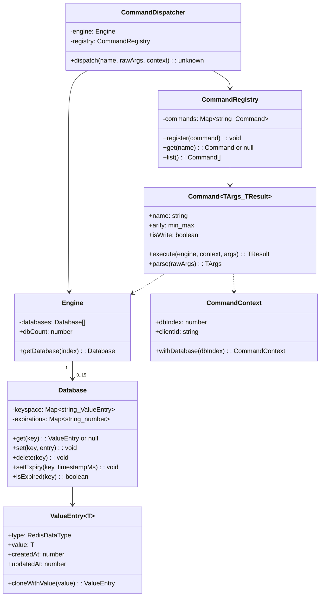
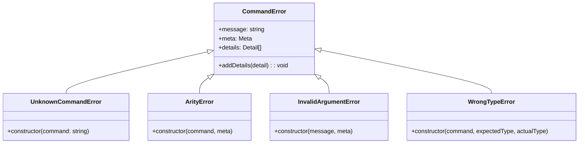
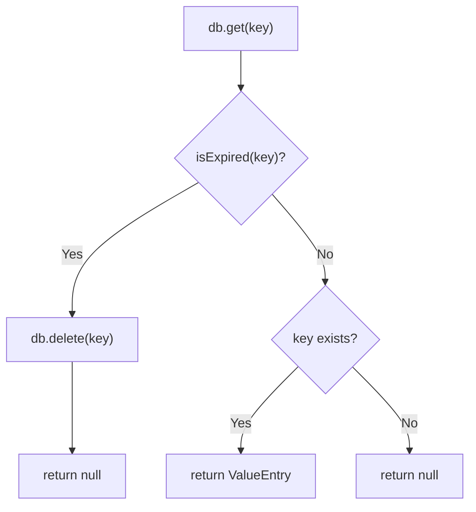
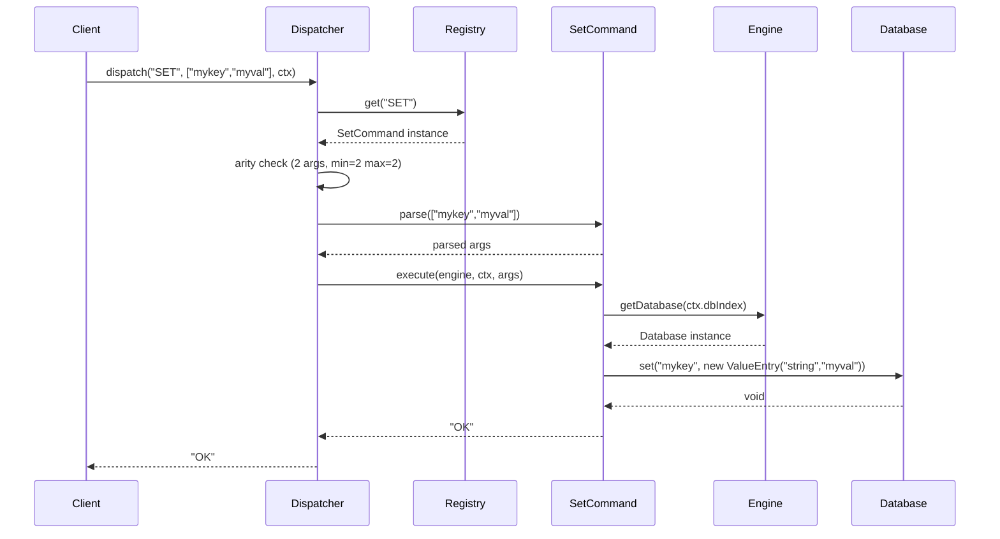
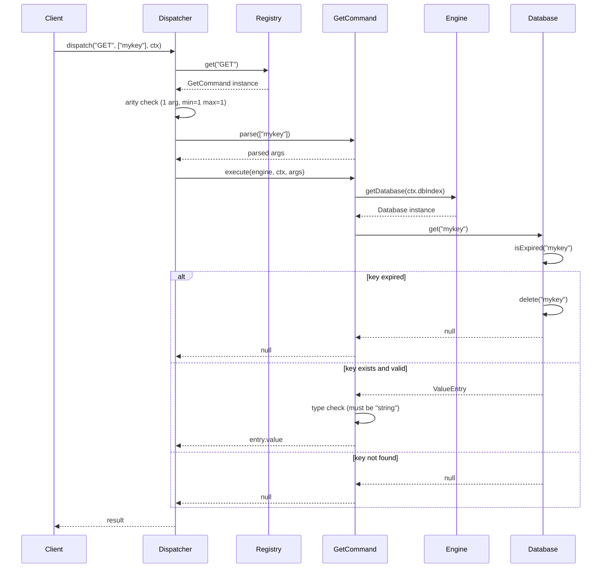
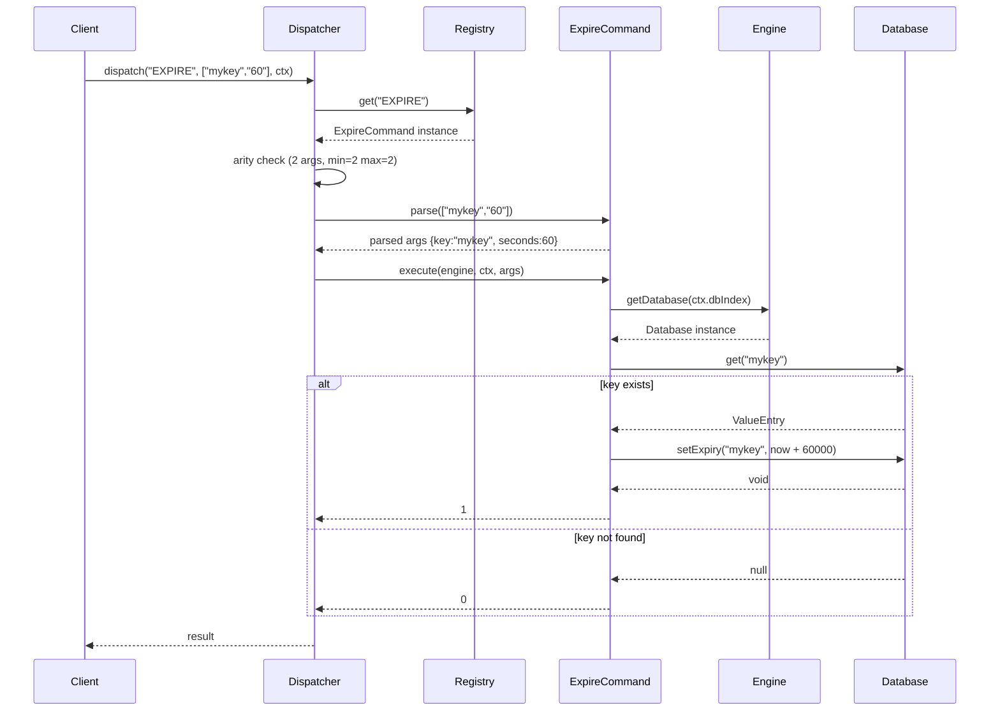

# Low-Level Design — Redis-Like In-Memory Data Store Engine

## 1. Class Diagram



---

## 2. Component Contracts

### 2.1 Engine (`src/engine/engine.ts`)

| Method | Signature | Behavior |
|---|---|---|
| `constructor` | `(dbCount?: number)` | Creates `dbCount` (default 16) Database instances. |
| `getDatabase` | `(index: number): Database` | Returns the Database at `index`. Throws if index is out of range `[0, dbCount)`. |

**Invariants:**
- `databases` array is private and never exposed directly.
- `dbCount` is readonly after construction.
- Engine does not know about commands or protocol.

### 2.2 Database (`src/engine/database.ts`)

| Method | Signature | Behavior |
|---|---|---|
| `get` | `(key: string): ValueEntry \| null` | Checks lazy expiry first. If expired, deletes key and returns `null`. Otherwise returns the entry or `null` if key does not exist. |
| `set` | `(key: string, entry: ValueEntry): void` | Overwrites the key in the keyspace. Does **not** touch the expirations map. |
| `delete` | `(key: string): void` | Removes key from both `keyspace` and `expirations`. |
| `setExpiry` | `(key: string, timestampMs: number): void` | Sets absolute expiry timestamp. No-op if key does not exist in keyspace. |
| `isExpired` | `(key: string): boolean` | Returns `true` if the key has an expiry and `Date.now() >= expiry`. Does not delete. |

**Invariants:**
- Database never knows about commands or business logic.
- TTL is stored separately in `expirations: Map<string, number>` (absolute ms timestamps).
- `set()` preserves existing TTL — it only writes to `keyspace`, never to `expirations`.

### 2.3 ValueEntry (`src/engine/valueEntry.ts`)

| Member | Type | Description |
|---|---|---|
| `type` | `RedisDataType` | One of `"string" \| "list" \| "set" \| "hash" \| "stream"` |
| `value` | `T` (generic) | The stored value |
| `createdAt` | `number` | Timestamp (ms) when the entry was first created |
| `updatedAt` | `number` | Timestamp (ms) of the most recent creation/clone |

| Method | Signature | Behavior |
|---|---|---|
| `constructor` | `(type, value, createdAt?)` | Sets `type`, `value`, `createdAt` (defaults to `Date.now()`), `updatedAt` to `Date.now()`. |
| `cloneWithValue` | `<U>(value: U): ValueEntry<U>` | Creates a new `ValueEntry` with the same `type` and original `createdAt`, but new `value` and fresh `updatedAt`. |

**Invariants:**
- Immutable after construction. All fields are `readonly`.
- Updates always produce new instances via `cloneWithValue()`.
- No in-place mutation of stored values.

### 2.4 Command (`src/commands/command.ts`)

| Member | Type | Description |
|---|---|---|
| `name` | `string` | Canonical command name (e.g. `"SET"`, `"GET"`) |
| `arity` | `{ min: number; max: number }` | Argument count bounds (excluding the command name) |
| `isWrite` | `boolean` | Whether the command mutates state |

| Method | Signature | Description |
|---|---|---|
| `execute` | `(engine, context, args): TResult` | Synchronous. No IO. Performs the command logic. |
| `parse` | `(rawArgs: unknown[]): TArgs` | Optional. Pure validation/normalization. Throws on invalid input. |

### 2.5 CommandDispatcher (`src/commands/dispatcher.ts`)

| Method | Signature | Behavior |
|---|---|---|
| `dispatch` | `(commandName, rawArgs, context): unknown` | 1. Looks up command via Registry. 2. Validates arity. 3. Calls `parse()` if defined. 4. Calls `execute()`. Returns result. |

**Invariants:**
- Dispatcher does not understand argument semantics.
- Dispatcher does not contain business logic.
- Orchestration only: lookup, validate, delegate.

### 2.6 CommandRegistry (`src/commands/registry.ts`)

| Method | Signature | Behavior |
|---|---|---|
| `register` | `(command: Command): void` | Registers command by uppercase name. Throws on duplicate. |
| `get` | `(name: string): Command \| null` | Resolves command by uppercase name. Returns `null` if not found. |
| `list` | `(): Command[]` | Returns all registered commands (for introspection). |

### 2.7 CommandContext (`src/commands/context.ts`)

| Member | Type | Description |
|---|---|---|
| `dbIndex` | `number` | Selected database index (0-15) |
| `clientId` | `string \| undefined` | Client metadata for future pub/sub and connection tracking |

| Method | Signature | Behavior |
|---|---|---|
| `withDatabase` | `(dbIndex: number): CommandContext` | Returns a new `CommandContext` with updated `dbIndex`. Immutable pattern. |

---

## 3. Command Implementations (Phase 1)

### 3.1 SET Command

**File:** `src/commands/handlers/string.ts`

| Property | Value |
|---|---|
| Name | `SET` |
| Arity | `{ min: 2, max: 2 }` |
| isWrite | `true` |

**Parse:**
1. Validate `rawArgs[0]` (key) is a string. Throw `InvalidArgumentError` if not.
2. Validate `rawArgs[1]` (value) is a string. Empty strings are allowed. Throw `InvalidArgumentError` if not.
3. Return `{ key: string, value: string }`.

**Execute:**
1. Get the database: `engine.getDatabase(context.dbIndex)`.
2. Create a new `ValueEntry("string", args.value)`.
3. Call `db.set(args.key, entry)`.
4. Return `"OK"`.

**Critical constraint:** SET must **not** touch TTL. If a key already has an expiry, it is preserved. This is enforced by `Database.set()` which only writes to `keyspace`.

---

### 3.2 GET Command

**File:** `src/commands/handlers/string.ts`

| Property | Value |
|---|---|
| Name | `GET` |
| Arity | `{ min: 1, max: 1 }` |
| isWrite | `false` |

**Parse:**
1. Validate `rawArgs[0]` (key) is a string. Throw `InvalidArgumentError` if not.
2. Return `{ key: string }`.

**Execute:**
1. Get the database: `engine.getDatabase(context.dbIndex)`.
2. Call `db.get(args.key)` — this handles lazy expiry automatically.
3. If result is `null`, return `null`.
4. If result's `type` is not `"string"`, throw a `WrongTypeError`.
5. Return `entry.value`.

---

### 3.3 EXPIRE Command

**File:** `src/commands/handlers/ttl.ts`

| Property | Value |
|---|---|
| Name | `EXPIRE` |
| Arity | `{ min: 2, max: 2 }` |
| isWrite | `true` |

**Parse:**
1. Validate `rawArgs[0]` (key) is a string. Throw `InvalidArgumentError` if not.
2. Validate `rawArgs[1]` (seconds) is a positive integer. Throw `InvalidArgumentError` if not (no zero, no negative, no float).
3. Return `{ key: string, seconds: number }`.

**Execute:**
1. Get the database: `engine.getDatabase(context.dbIndex)`.
2. Call `db.get(args.key)` to check existence (also triggers lazy expiry).
3. If the key does not exist, return `0`.
4. Compute absolute timestamp: `Date.now() + args.seconds * 1000`.
5. Call `db.setExpiry(args.key, timestamp)`.
6. Return `1`.

---

## 4. Error Hierarchy



### Error Types

| Error | When Thrown | Example |
|---|---|---|
| `UnknownCommandError` | Command name not found in Registry | `dispatch("FOO", ...)` |
| `ArityError` | Argument count outside `[min, max]` | `SET key` (missing value) |
| `InvalidArgumentError` | Argument fails parse validation | `EXPIRE key "abc"` (not an integer) |
| `WrongTypeError` (new) | Operation on wrong data type | `GET` on a key holding a list |

### Meta Type

```typescript
type Meta = {
  command?: string;
  dbIndex?: number;
  clientId?: string;
  argsCount?: number;
}
```

All errors are deterministic, carry no heavy payloads, and use `Object.freeze` on meta to prevent mutation.

---

## 5. TTL Mechanism — Detailed Flow

### Storage
- `Database.expirations: Map<string, number>` — maps key to absolute expiry timestamp in milliseconds.
- Stored separately from the keyspace to avoid polluting value entries.

### Lazy Expiration Flow



### TTL Rules

| Operation | Effect on TTL |
|---|---|
| `SET key value` | **No effect** — existing TTL is preserved |
| `EXPIRE key seconds` | Sets/overwrites TTL |
| `DELETE key` | Removes TTL along with key |
| `GET key` (expired) | Triggers lazy deletion, TTL removed |

### `isExpired` Logic

```typescript
isExpired(key: string): boolean {
  const expiry = this.expirations.get(key);
  return expiry !== undefined && Date.now() >= expiry;
}
```

Checks only. Does not delete. Deletion is the caller's responsibility (`get()` handles this).

---

## 6. ValueEntry Invariants

### Construction

```typescript
new ValueEntry(type: RedisDataType, value: T, createdAt?: number)
```

- `createdAt` defaults to `Date.now()` if not provided.
- `updatedAt` is always set to `Date.now()` at construction time.
- All fields are `readonly`.

### Cloning

```typescript
cloneWithValue<U>(value: U): ValueEntry<U>
```

- Preserves `type` and original `createdAt`.
- Sets new `value` and fresh `updatedAt`.
- Returns a completely new instance.

### Type Safety

`RedisDataType = "string" | "list" | "set" | "hash" | "stream"`

Commands must validate the type of a retrieved `ValueEntry` before operating on it. A `GET` command receiving a non-string entry must throw `WrongTypeError`.

---

## 7. Sequence Diagrams

### 7.1 SET Command Flow



### 7.2 GET Command Flow (with lazy expiry)



### 7.3 EXPIRE Command Flow



---

## 8. New Type to Add — WrongTypeError

A new error class is needed for Phase 1 to handle type mismatches (e.g. `GET` on a list key).

**File:** `src/commands/errors.ts`

```typescript
export class WrongTypeError extends CommandError {
  constructor(command: string, expectedType: string, actualType: string) {
    super(
      `WRONGTYPE Operation against a key holding the wrong kind of value`,
      { command }
    );
    this.addDetails({ expectedType, actualType });
  }
}
```

This follows the Redis error format: `WRONGTYPE Operation against a key holding the wrong kind of value`.

---

## 9. File Structure After Phase 1 Implementation

```
src/
├── engine/
│   ├── engine.ts          (exists)
│   ├── database.ts        (exists)
│   ├── valueEntry.ts      (exists)
│   └── index.ts           (exists)
│
├── commands/
│   ├── command.ts          (exists)
│   ├── context.ts          (exists)
│   ├── dispatcher.ts       (exists)
│   ├── registry.ts         (exists)
│   ├── errors.ts           (exists — add WrongTypeError)
│   └── handlers/
│       ├── string.ts       (new — SET, GET)
│       └── ttl.ts          (new — EXPIRE)
│
├── configs/
│   ├── defaults.ts         (exists)
│   └── index.ts            (exists)
│
└── index.ts                (new — entry point)
```
