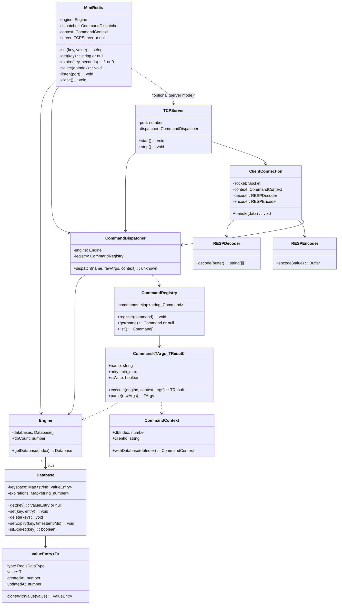
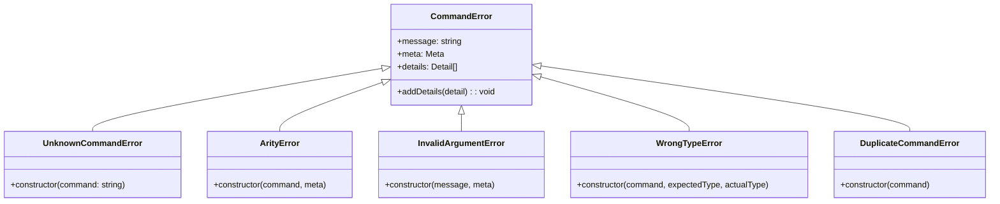
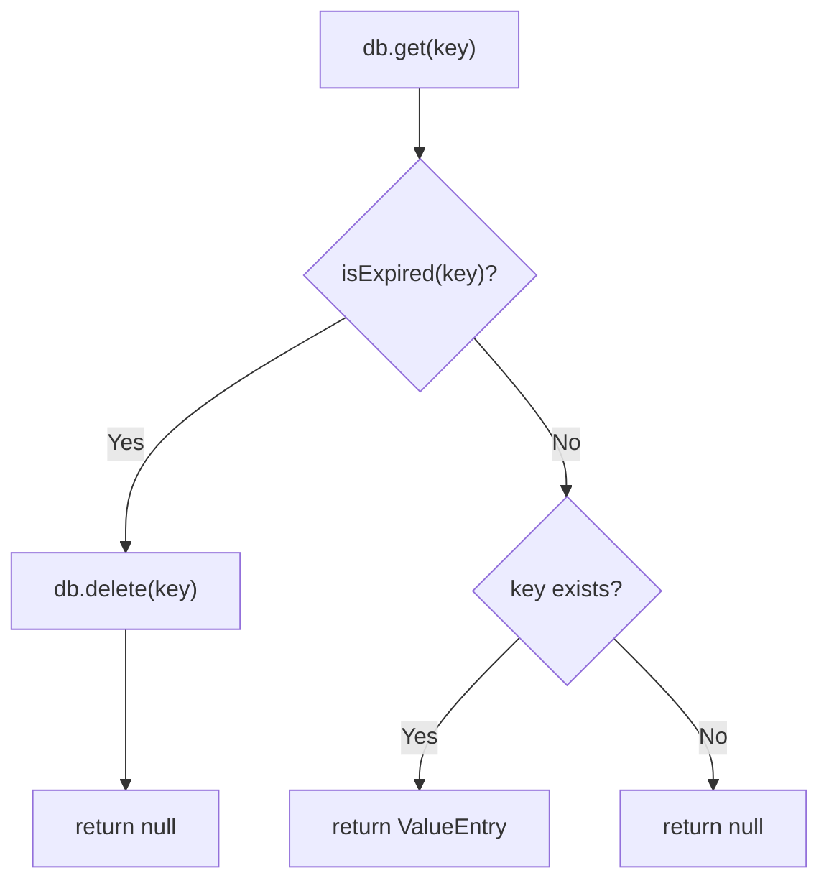
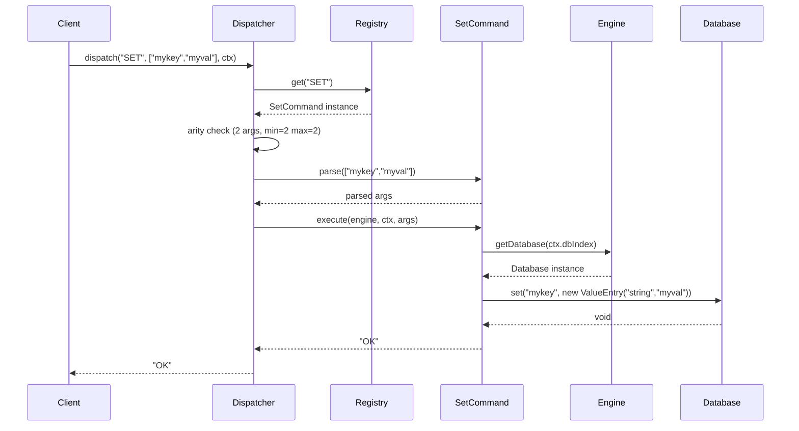
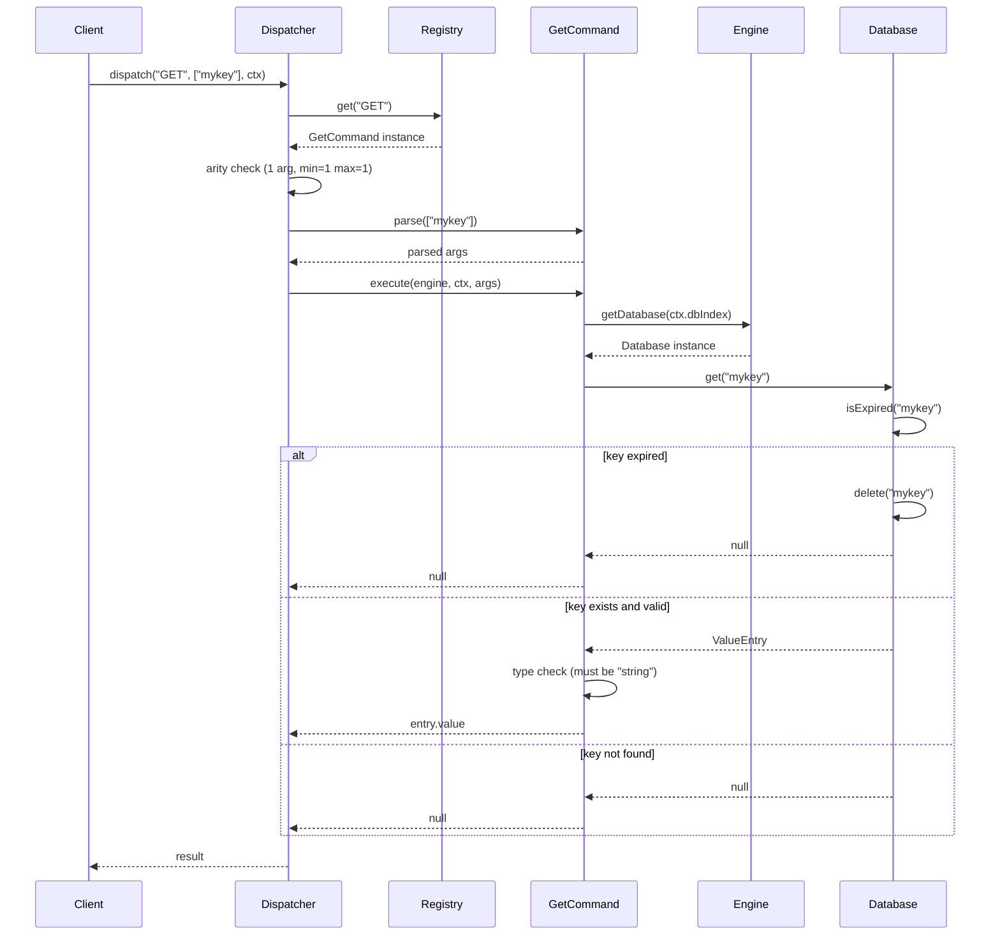
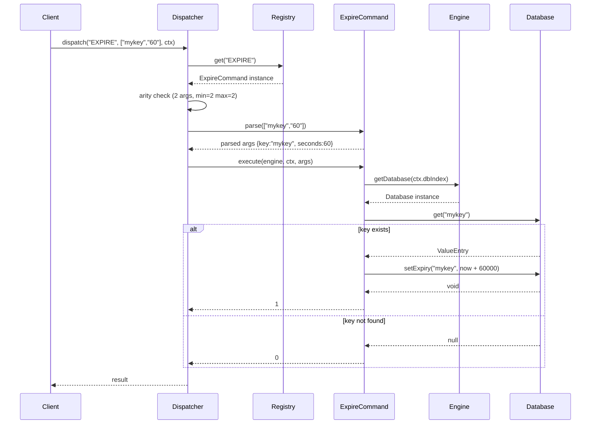
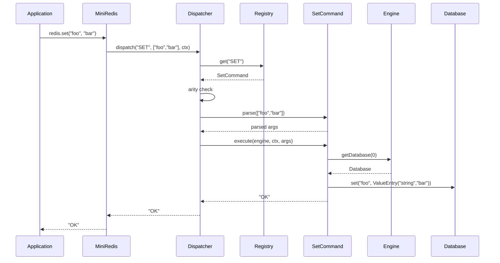
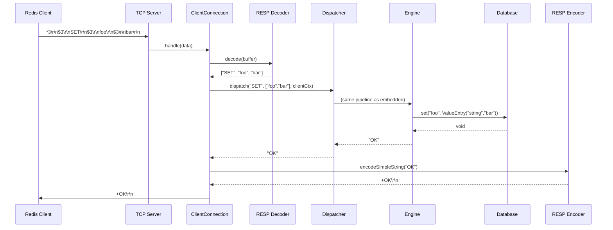
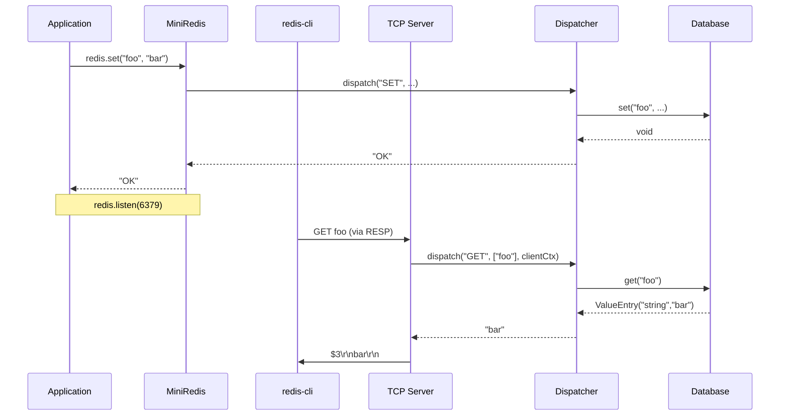

# Low-Level Design — Redis-Like In-Memory Data Store Engine

## 1. Class Diagram


```mermaid
classDiagram
    class MiniRedis {
        -engine: Engine
        -dispatcher: CommandDispatcher
        -context: CommandContext
        -server: TCPServer or null
        +set(key, value): string
        +get(key): string or null
        +expire(key, seconds): 1 or 0
        +select(dbIndex): void
        +listen(port): void
        +close(): void
    }

    class Engine {
        -databases: Database[]
        +dbCount: number
        +getDatabase(index): Database
    }

    class Database {
        -keyspace: Map~string_ValueEntry~
        -expirations: Map~string_number~
        +get(key): ValueEntry or null
        +set(key, entry): void
        +delete(key): void
        +setExpiry(key, timestampMs): void
        +isExpired(key): boolean
    }

    class ValueEntry~T~ {
        +type: RedisDataType
        +value: T
        +createdAt: number
        +updatedAt: number
        +cloneWithValue(value): ValueEntry
    }

    class Command~TArgs_TResult~ {
        +name: string
        +arity: min_max
        +isWrite: boolean
        +execute(engine, context, args): TResult
        +parse(rawArgs): TArgs
    }

    class CommandDispatcher {
        -engine: Engine
        -registry: CommandRegistry
        +dispatch(name, rawArgs, context): unknown
    }

    class CommandRegistry {
        -commands: Map~string_Command~
        +register(command): void
        +get(name): Command or null
        +list(): Command[]
    }

    class CommandContext {
        +dbIndex: number
        +clientId: string
        +withDatabase(dbIndex): CommandContext
    }

    class RESPEncoder {
        +encode(value): Buffer
    }

    class RESPDecoder {
        +decode(buffer): string[][]
    }

    class TCPServer {
        -port: number
        -dispatcher: CommandDispatcher
        +start(): void
        +stop(): void
    }

    class ClientConnection {
        -socket: Socket
        -context: CommandContext
        -decoder: RESPDecoder
        -encoder: RESPEncoder
        +handle(data): void
    }

    MiniRedis --> Engine
    MiniRedis --> CommandDispatcher
    MiniRedis ..> TCPServer : "optional (server mode)"
    Engine "1" --> "0..15" Database
    Database --> ValueEntry
    CommandDispatcher --> Engine
    CommandDispatcher --> CommandRegistry
    CommandRegistry --> Command
    Command ..> Engine
    Command ..> CommandContext
    TCPServer --> CommandDispatcher
    TCPServer --> ClientConnection
    ClientConnection --> RESPDecoder
    ClientConnection --> RESPEncoder
    ClientConnection --> CommandDispatcher
```

---

## 2. Component Contracts

### 2.1 Engine (`src/engine/engine.ts`)

| Method | Signature | Behavior |
|---|---|---|
| `constructor` | `(dbCount?: number)` | Creates `dbCount` (default 16) Database instances. |
| `getDatabase` | `(index: number): Database` | Returns the Database at `index`. Throws `DatabaseIndexOutOfRangeError` if index is out of range `[0, dbCount)`. |

**Invariants:**
- `databases` array is private and never exposed directly.
- `dbCount` is readonly after construction.
- Engine does not know about commands or protocol.

### 2.2 Database (`src/engine/database.ts`)

| Method | Signature | Behavior |
|---|---|---|
| `get` | `(key: string): ValueEntry \| null` | Checks lazy expiry first. If expired, deletes key and returns `null`. Otherwise returns the entry or `null` if key does not exist. |
| `set` | `(key: string, entry: ValueEntry): void` | Overwrites the key in the keyspace. Does **not** touch the expirations map. |
| `delete` | `(key: string): void` | Removes key from both `keyspace` and `expirations`. |
| `setExpiry` | `(key: string, timestampMs: number): void` | Sets absolute expiry timestamp. No-op if key does not exist in keyspace. |
| `isExpired` | `(key: string): boolean` | Returns `true` if the key has an expiry and `Date.now() >= expiry`. Does not delete. |

**Invariants:**
- Database never knows about commands or business logic.
- TTL is stored separately in `expirations: Map<string, number>` (absolute ms timestamps).
- `set()` preserves existing TTL — it only writes to `keyspace`, never to `expirations`.

### 2.3 ValueEntry (`src/engine/valueEntry.ts`)

| Member | Type | Description |
|---|---|---|
| `type` | `RedisDataType` | One of `"string" \| "list" \| "set" \| "hash" \| "stream"` |
| `value` | `T` (generic) | The stored value |
| `createdAt` | `number` | Timestamp (ms) when the entry was first created |
| `updatedAt` | `number` | Timestamp (ms) of the most recent creation/clone |

| Method | Signature | Behavior |
|---|---|---|
| `constructor` | `(type, value, createdAt?)` | Sets `type`, `value`, `createdAt` (defaults to `Date.now()`), `updatedAt` to `Date.now()`. |
| `cloneWithValue` | `<U>(value: U): ValueEntry<U>` | Creates a new `ValueEntry` with the same `type` and original `createdAt`, but new `value` and fresh `updatedAt`. |

**Invariants:**
- Immutable after construction. All fields are `readonly`.
- Updates always produce new instances via `cloneWithValue()`.
- No in-place mutation of stored values.

### 2.4 Command (`src/commands/command.ts`)

| Member | Type | Description |
|---|---|---|
| `name` | `string` | Canonical command name (e.g. `"SET"`, `"GET"`) |
| `arity` | `{ min: number; max: number }` | Argument count bounds (excluding the command name) |
| `isWrite` | `boolean` | Whether the command mutates state |

| Method | Signature | Description |
|---|---|---|
| `execute` | `(engine, context, args): TResult` | Synchronous. No IO. Performs the command logic. |
| `parse` | `(rawArgs: unknown[]): TArgs` | Optional. Pure validation/normalization. Throws on invalid input. |

### 2.5 CommandDispatcher (`src/commands/dispatcher.ts`)

| Method | Signature | Behavior |
|---|---|---|
| `dispatch` | `(commandName, rawArgs, context): unknown` | 1. Looks up command via Registry. 2. Validates arity. 3. Calls `parse()` if defined. 4. Calls `execute()`. Returns result. |

**Invariants:**
- Dispatcher does not understand argument semantics.
- Dispatcher does not contain business logic.
- Orchestration only: lookup, validate, delegate.

### 2.6 CommandRegistry (`src/commands/registry.ts`)

| Method | Signature | Behavior |
|---|---|---|
| `register` | `(command: Command): void` | Registers command by uppercase name. Throws `DuplicateCommandError` on duplicate. |
| `get` | `(name: string): Command \| null` | Resolves command by uppercase name. Returns `null` if not found. |
| `list` | `(): Command[]` | Returns all registered commands (for introspection). |

### 2.7 CommandContext (`src/commands/context.ts`)

| Member | Type | Description |
|---|---|---|
| `dbIndex` | `number` | Selected database index (0-15) |
| `clientId` | `string \| undefined` | Client metadata for future pub/sub and connection tracking |

| Method | Signature | Behavior |
|---|---|---|
| `withDatabase` | `(dbIndex: number): CommandContext` | Returns a new `CommandContext` with updated `dbIndex`. Immutable pattern. |

### 2.8 MiniRedis — Public Facade (`src/client/miniRedis.ts`) — Phase 2A

The consumer-facing class. Owns the engine and dispatcher internally. Provides a fluent, type-safe API.

| Member | Type | Description |
|---|---|---|
| `engine` (private) | `Engine` | The in-memory engine instance |
| `dispatcher` (private) | `CommandDispatcher` | Pre-configured dispatcher with all commands registered |
| `context` (private, mutable) | `CommandContext` | Tracks the active database index |
| `server` (private) | `TCPServer \| null` | TCP server instance, `null` until `.listen()` is called |

| Method | Signature | Behavior |
|---|---|---|
| `constructor` | `(options?: MiniRedisOptions)` | Creates engine, registers all commands, initializes dispatcher. Accepts optional config (e.g. `dbCount`). |
| `set` | `(key: string, value: string): string` | Dispatches `SET` command. Returns `"OK"`. |
| `get` | `(key: string): string \| null` | Dispatches `GET` command. Returns value or `null`. |
| `expire` | `(key: string, seconds: number): 1 \| 0` | Dispatches `EXPIRE` command. Returns `1` if TTL was set, `0` if key doesn't exist. |
| `select` | `(dbIndex: number): void` | Updates internal `context` to point to the specified database. Validates index bounds. |
| `listen` | `(port: number): void` | Starts TCP server on the given port (Phase 2C). Same engine, same data. |
| `close` | `(): void` | Stops the TCP server if running. |

**Invariants:**
- `MiniRedis` is the only public export. Consumers never import `Engine`, `CommandDispatcher`, or `Database` directly.
- Each fluent method maps 1:1 to a registered command via `dispatcher.dispatch()`.
- Adding a new command to MiniRedis requires: (1) implement the `Command` subclass, (2) register it, (3) add a typed method to `MiniRedis`. Two touch points.
- `context` is mutable only via `.select()`. The `dbIndex` defaults to `0`.

**Options type:**

```typescript
type MiniRedisOptions = {
  dbCount?: number;  // default: 16
}
```

**Internal wiring (pseudocode):**

```typescript
class MiniRedis {
  private engine: Engine;
  private dispatcher: CommandDispatcher;
  private context: CommandContext;

  constructor(options?: MiniRedisOptions) {
    this.engine = new Engine(options?.dbCount);
    const registry = new CommandRegistry();
    // register all commands
    registry.register(new SetCommand());
    registry.register(new GetCommand());
    registry.register(new ExpireCommand());
    this.dispatcher = new CommandDispatcher(this.engine, registry);
    this.context = new CommandContext(0);
  }

  set(key: string, value: string): string {
    return this.dispatcher.dispatch("SET", [key, value], this.context) as string;
  }

  get(key: string): string | null {
    return this.dispatcher.dispatch("GET", [key], this.context) as string | null;
  }

  expire(key: string, seconds: number): 1 | 0 {
    return this.dispatcher.dispatch("EXPIRE", [key, String(seconds)], this.context) as 1 | 0;
  }

  select(dbIndex: number): void {
    this.context = this.context.withDatabase(dbIndex);
  }
}
```

### 2.9 RESP Encoder/Decoder (`src/protocol/resp.ts`) — Phase 2B

RESP (REdis Serialization Protocol) is the binary-safe wire format for Redis client-server communication.

**RESP Data Types:**

| Prefix | Type | Example |
|---|---|---|
| `+` | Simple String | `+OK\r\n` |
| `-` | Error | `-ERR unknown command\r\n` |
| `:` | Integer | `:1\r\n` |
| `$` | Bulk String | `$3\r\nbar\r\n` |
| `$-1` | Null Bulk String | `$-1\r\n` |
| `*` | Array | `*2\r\n$3\r\nfoo\r\n$3\r\nbar\r\n` |

**RESPDecoder:**

| Method | Signature | Behavior |
|---|---|---|
| `decode` | `(buffer: Buffer): string[][]` | Parses raw bytes into an array of command arrays. Handles pipelining (multiple commands in one buffer). |

**RESPEncoder:**

| Method | Signature | Behavior |
|---|---|---|
| `encodeSimpleString` | `(value: string): Buffer` | Encodes `+{value}\r\n` |
| `encodeError` | `(message: string): Buffer` | Encodes `-{message}\r\n` |
| `encodeInteger` | `(value: number): Buffer` | Encodes `:{value}\r\n` |
| `encodeBulkString` | `(value: string \| null): Buffer` | Encodes `${len}\r\n{value}\r\n` or `$-1\r\n` for null |
| `encode` | `(value: unknown): Buffer` | Auto-detects type and delegates to the appropriate encoder |

**Dependency decision:** Use `redis-parser` npm package for decoding (battle-tested, handles edge cases like partial reads and pipelining) or hand-roll a simpler decoder if the project's educational goal requires it.

### 2.10 TCPServer (`src/server/tcp.ts`) — Phase 2C

| Member | Type | Description |
|---|---|---|
| `port` (private) | `number` | Port to listen on |
| `dispatcher` (private) | `CommandDispatcher` | Shared dispatcher instance (same one MiniRedis uses) |
| `engine` (private) | `Engine` | Shared engine instance |
| `listener` (private) | `Server \| null` | Bun TCP server handle |

| Method | Signature | Behavior |
|---|---|---|
| `start` | `(): void` | Calls `Bun.listen()` on the configured port. Creates a `ClientConnection` per incoming socket. |
| `stop` | `(): void` | Closes all active connections and stops the listener. |

### 2.11 ClientConnection (`src/server/connection.ts`) — Phase 2C

Manages a single TCP client session.

| Member | Type | Description |
|---|---|---|
| `socket` (private) | `Socket` | The raw TCP socket |
| `context` (private) | `CommandContext` | Per-client context (tracks selected database, client ID) |
| `decoder` (private) | `RESPDecoder` | Decodes incoming bytes |
| `encoder` (private) | `RESPEncoder` | Encodes outgoing responses |
| `dispatcher` (private) | `CommandDispatcher` | Shared dispatcher |

| Method | Signature | Behavior |
|---|---|---|
| `handle` | `(data: Buffer): void` | Decodes RESP → extracts command name + args → dispatches → encodes result → writes to socket |

**Per-client state:**
- Each connection has its own `CommandContext` with a unique `clientId` and independent `dbIndex` (starts at 0).
- `SELECT` commands update only that connection's context.
- All connections share the same `Engine` instance — reads/writes to the same keyspace.

---

## 3. Command Implementations (Phase 1)

### 3.1 SET Command

**File:** `src/commands/handlers/string.ts`

| Property | Value |
|---|---|
| Name | `SET` |
| Arity | `{ min: 2, max: 2 }` |
| isWrite | `true` |

**Parse:**
1. Validate `rawArgs[0]` (key) is a string. Throw `InvalidArgumentError` if not.
2. Validate `rawArgs[1]` (value) is a string. Empty strings are allowed. Throw `InvalidArgumentError` if not.
3. Return `{ key: string, value: string }`.

**Execute:**
1. Get the database: `engine.getDatabase(context.dbIndex)`.
2. Create a new `ValueEntry("string", args.value)`.
3. Call `db.set(args.key, entry)`.
4. Return `"OK"`.

**Critical constraint:** SET must **not** touch TTL. If a key already has an expiry, it is preserved. This is enforced by `Database.set()` which only writes to `keyspace`.

---

### 3.2 GET Command

**File:** `src/commands/handlers/string.ts`

| Property | Value |
|---|---|
| Name | `GET` |
| Arity | `{ min: 1, max: 1 }` |
| isWrite | `false` |

**Parse:**
1. Validate `rawArgs[0]` (key) is a string. Throw `InvalidArgumentError` if not.
2. Return `{ key: string }`.

**Execute:**
1. Get the database: `engine.getDatabase(context.dbIndex)`.
2. Call `db.get(args.key)` — this handles lazy expiry automatically.
3. If result is `null`, return `null`.
4. If result's `type` is not `"string"`, throw a `WrongTypeError`.
5. Return `entry.value`.

---

### 3.3 EXPIRE Command

**File:** `src/commands/handlers/ttl.ts`

| Property | Value |
|---|---|
| Name | `EXPIRE` |
| Arity | `{ min: 2, max: 2 }` |
| isWrite | `true` |

**Parse:**
1. Validate `rawArgs[0]` (key) is a string. Throw `InvalidArgumentError` if not.
2. Validate `rawArgs[1]` (seconds) is an integer. Throw `InvalidArgumentError` if not (no float, no NaN, no Infinity).
3. Return `{ key: string, seconds: number }`.

**Execute:**
1. Get the database: `engine.getDatabase(context.dbIndex)`.
2. Call `db.get(args.key)` to check existence (also triggers lazy expiry).
3. If the key does not exist, return `0`.
4. If `args.seconds <= 0`, delete the key immediately and return `1` (Redis-compatible immediate expiry).
5. Otherwise compute absolute timestamp: `Date.now() + args.seconds * 1000`.
6. Call `db.setExpiry(args.key, timestamp)`.
7. Return `1`.

---

## 4. Error Hierarchy


```mermaid
classDiagram
    class CommandError {
        +message: string
        +meta: Meta
        +details: Detail[]
        +addDetails(detail): void
    }

    class UnknownCommandError {
        +constructor(command: string)
    }

    class ArityError {
        +constructor(command, meta)
    }

    class InvalidArgumentError {
        +constructor(message, meta)
    }

    class WrongTypeError {
        +constructor(command, expectedType, actualType)
    }

    class DuplicateCommandError {
        +constructor(command)
    }

    CommandError <|-- UnknownCommandError
    CommandError <|-- ArityError
    CommandError <|-- InvalidArgumentError
    CommandError <|-- WrongTypeError
    CommandError <|-- DuplicateCommandError
```

### Error Types

| Error | When Thrown | Example |
|---|---|---|
| `UnknownCommandError` | Command name not found in Registry | `dispatch("FOO", ...)` |
| `ArityError` | Argument count outside `[min, max]` | `SET key` (missing value) |
| `InvalidArgumentError` | Argument fails parse validation | `EXPIRE key "abc"` (not an integer) |
| `WrongTypeError` (new) | Operation on wrong data type | `GET` on a key holding a list |
| `DuplicateCommandError` | Command registration duplicates an existing name | Registering `SET` twice |

### Meta Type

```typescript
type Meta = {
  command?: string;
  dbIndex?: number;
  clientId?: string;
  argsCount?: number;
}
```

`ArityError` also attaches deterministic details payload `{ min, max, actual }`.

All command errors are deterministic, carry no heavy payloads, and use `Object.freeze` on meta/details objects to prevent mutation.

### Engine Error Types

| Error | When Thrown | Example |
|---|---|---|
| `DatabaseIndexOutOfRangeError` | Database index is outside `[0, dbCount)` | `engine.getDatabase(-1)` |

---

## 5. TTL Mechanism — Detailed Flow

### Storage
- `Database.expirations: Map<string, number>` — maps key to absolute expiry timestamp in milliseconds.
- Stored separately from the keyspace to avoid polluting value entries.

### Lazy Expiration Flow


```mermaid
flowchart TD
    A["db.get(key)"] --> B{"isExpired(key)?"}
    B -->|Yes| C["db.delete(key)"]
    C --> D["return null"]
    B -->|No| E{"key exists?"}
    E -->|Yes| F["return ValueEntry"]
    E -->|No| G["return null"]
```

### TTL Rules

| Operation | Effect on TTL |
|---|---|
| `SET key value` | **No effect** — existing TTL is preserved |
| `EXPIRE key seconds` | Sets/overwrites TTL |
| `DELETE key` | Removes TTL along with key |
| `GET key` (expired) | Triggers lazy deletion, TTL removed |

### `isExpired` Logic

```typescript
isExpired(key: string): boolean {
  const expiry = this.expirations.get(key);
  return expiry !== undefined && Date.now() >= expiry;
}
```

Checks only. Does not delete. Deletion is the caller's responsibility (`get()` handles this).

---

## 6. ValueEntry Invariants

### Construction

```typescript
new ValueEntry(type: RedisDataType, value: T, createdAt?: number)
```

- `createdAt` defaults to `Date.now()` if not provided.
- `updatedAt` is always set to `Date.now()` at construction time.
- All fields are `readonly`.

### Cloning

```typescript
cloneWithValue<U>(value: U): ValueEntry<U>
```

- Preserves `type` and original `createdAt`.
- Sets new `value` and fresh `updatedAt`.
- Returns a completely new instance.

### Type Safety

`RedisDataType = "string" | "list" | "set" | "hash" | "stream"`

Commands must validate the type of a retrieved `ValueEntry` before operating on it. A `GET` command receiving a non-string entry must throw `WrongTypeError`.

---

## 7. Sequence Diagrams

### 7.1 SET Command Flow


```mermaid
sequenceDiagram
    participant C as Client
    participant D as Dispatcher
    participant R as Registry
    participant Cmd as SetCommand
    participant E as Engine
    participant DB as Database

    C->>D: dispatch("SET", ["mykey","myval"], ctx)
    D->>R: get("SET")
    R-->>D: SetCommand instance
    D->>D: arity check (2 args, min=2 max=2)
    D->>Cmd: parse(["mykey","myval"])
    Cmd-->>D: parsed args
    D->>Cmd: execute(engine, ctx, args)
    Cmd->>E: getDatabase(ctx.dbIndex)
    E-->>Cmd: Database instance
    Cmd->>DB: set("mykey", new ValueEntry("string","myval"))
    DB-->>Cmd: void
    Cmd-->>D: "OK"
    D-->>C: "OK"
```

### 7.2 GET Command Flow (with lazy expiry)


```mermaid
sequenceDiagram
    participant C as Client
    participant D as Dispatcher
    participant R as Registry
    participant Cmd as GetCommand
    participant E as Engine
    participant DB as Database

    C->>D: dispatch("GET", ["mykey"], ctx)
    D->>R: get("GET")
    R-->>D: GetCommand instance
    D->>D: arity check (1 arg, min=1 max=1)
    D->>Cmd: parse(["mykey"])
    Cmd-->>D: parsed args
    D->>Cmd: execute(engine, ctx, args)
    Cmd->>E: getDatabase(ctx.dbIndex)
    E-->>Cmd: Database instance
    Cmd->>DB: get("mykey")
    DB->>DB: isExpired("mykey")
    alt key expired
        DB->>DB: delete("mykey")
        DB-->>Cmd: null
        Cmd-->>D: null
    else key exists and valid
        DB-->>Cmd: ValueEntry
        Cmd->>Cmd: type check (must be "string")
        Cmd-->>D: entry.value
    else key not found
        DB-->>Cmd: null
        Cmd-->>D: null
    end
    D-->>C: result
```

### 7.3 EXPIRE Command Flow


```mermaid
sequenceDiagram
    participant C as Client
    participant D as Dispatcher
    participant R as Registry
    participant Cmd as ExpireCommand
    participant E as Engine
    participant DB as Database

    C->>D: dispatch("EXPIRE", ["mykey","60"], ctx)
    D->>R: get("EXPIRE")
    R-->>D: ExpireCommand instance
    D->>D: arity check (2 args, min=2 max=2)
    D->>Cmd: parse(["mykey","60"])
    Cmd-->>D: parsed args {key:"mykey", seconds:60}
    D->>Cmd: execute(engine, ctx, args)
    Cmd->>E: getDatabase(ctx.dbIndex)
    E-->>Cmd: Database instance
    Cmd->>DB: get("mykey")
    alt key exists
        DB-->>Cmd: ValueEntry
        Cmd->>DB: setExpiry("mykey", now + 60000)
        DB-->>Cmd: void
        Cmd-->>D: 1
    else key not found
        DB-->>Cmd: null
        Cmd-->>D: 0
    end
    D-->>C: result
```

---

## 8. Error Types Added in Phase 1

Phase 1 adds explicit typed errors for command and engine layers.

**Command errors file:** `src/commands/errors.ts`

```typescript
export class WrongTypeError extends CommandError {
  constructor(command: string, expectedType: string, actualType: string) {
    super(
      `WRONGTYPE Operation against a key holding the wrong kind of value`,
      { command }
    );
    this.addDetails({ expectedType, actualType });
  }
}
```

```typescript
export class DuplicateCommandError extends CommandError {
  constructor(command: string) {
    super(`Command '${command}' is already registered`, { command });
  }
}
```

**Engine errors file:** `src/engine/errors.ts`

```typescript
export class DatabaseIndexOutOfRangeError extends EngineError {
  constructor(index: number, dbCount: number) {
    super(`Database index out of range: ${index}. Expected 0..${dbCount - 1}`, {
      dbIndex: index,
      minDbIndex: 0,
      maxDbIndex: dbCount - 1,
    });
  }
}
```

`WrongTypeError` follows the Redis error format: `WRONGTYPE Operation against a key holding the wrong kind of value`.

---

## 9. File Structure (Current + Planned)

```
src/
├── engine/                  (Phase 1 — implemented)
│   ├── engine.ts
│   ├── database.ts
│   ├── valueEntry.ts
│   ├── errors.ts
│   └── index.ts
│
├── commands/                (Phase 1 — implemented)
│   ├── command.ts
│   ├── context.ts
│   ├── dispatcher.ts
│   ├── registry.ts
│   ├── errors.ts
│   ├── index.ts
│   └── handlers/
│       ├── string.ts
│       └── ttl.ts
│
├── configs/                 (Phase 1 — implemented)
│   ├── defaults.ts
│   └── index.ts
│
├── client/                  (Phase 2A — next)
│   ├── miniRedis.ts         MiniRedis facade class
│   └── index.ts             barrel export
│
├── protocol/                (Phase 2B — deferred)
│   └── resp.ts              RESP encoder/decoder
│
├── server/                  (Phase 2C — deferred)
│   ├── tcp.ts               Bun.listen TCP server
│   └── connection.ts        per-client session handler
│
└── index.ts                 (Phase 2A — re-exports MiniRedis)
```

---

## 10. Sequence Diagrams — Phase 2

### 10.1 Embedded Mode — `redis.set("foo", "bar")`


```mermaid
sequenceDiagram
    participant App as Application
    participant MR as MiniRedis
    participant D as Dispatcher
    participant R as Registry
    participant Cmd as SetCommand
    participant E as Engine
    participant DB as Database

    App->>MR: redis.set("foo", "bar")
    MR->>D: dispatch("SET", ["foo","bar"], ctx)
    D->>R: get("SET")
    R-->>D: SetCommand
    D->>D: arity check
    D->>Cmd: parse(["foo","bar"])
    Cmd-->>D: parsed args
    D->>Cmd: execute(engine, ctx, args)
    Cmd->>E: getDatabase(0)
    E-->>Cmd: Database
    Cmd->>DB: set("foo", ValueEntry("string","bar"))
    Cmd-->>D: "OK"
    D-->>MR: "OK"
    MR-->>App: "OK"
```

### 10.2 Server Mode — Remote Client `SET foo bar`


```mermaid
sequenceDiagram
    participant RC as Redis Client
    participant TCP as TCP Server
    participant Conn as ClientConnection
    participant RESP as RESP Decoder
    participant D as Dispatcher
    participant E as Engine
    participant DB as Database
    participant Enc as RESP Encoder

    RC->>TCP: *3\r\n$3\r\nSET\r\n$3\r\nfoo\r\n$3\r\nbar\r\n
    TCP->>Conn: handle(data)
    Conn->>RESP: decode(buffer)
    RESP-->>Conn: ["SET", "foo", "bar"]
    Conn->>D: dispatch("SET", ["foo","bar"], clientCtx)
    D->>E: (same pipeline as embedded)
    E->>DB: set("foo", ValueEntry("string","bar"))
    DB-->>E: void
    E-->>D: "OK"
    D-->>Conn: "OK"
    Conn->>Enc: encodeSimpleString("OK")
    Enc-->>Conn: +OK\r\n
    Conn->>RC: +OK\r\n
```

### 10.3 Mixed Mode — Embedded + Remote on Same Engine


```mermaid
sequenceDiagram
    participant App as Application
    participant MR as MiniRedis
    participant RC as redis-cli
    participant TCP as TCP Server
    participant D as Dispatcher
    participant DB as Database

    App->>MR: redis.set("foo", "bar")
    MR->>D: dispatch("SET", ...)
    D->>DB: set("foo", ...)
    DB-->>D: void
    D-->>MR: "OK"
    MR-->>App: "OK"

    Note over App,MR: redis.listen(6379)

    RC->>TCP: GET foo (via RESP)
    TCP->>D: dispatch("GET", ["foo"], clientCtx)
    D->>DB: get("foo")
    DB-->>D: ValueEntry("string","bar")
    D-->>TCP: "bar"
    TCP->>RC: $3\r\nbar\r\n
```
